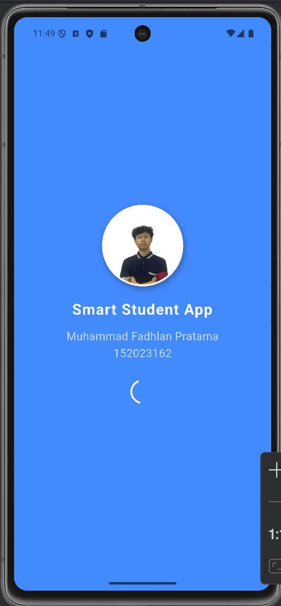
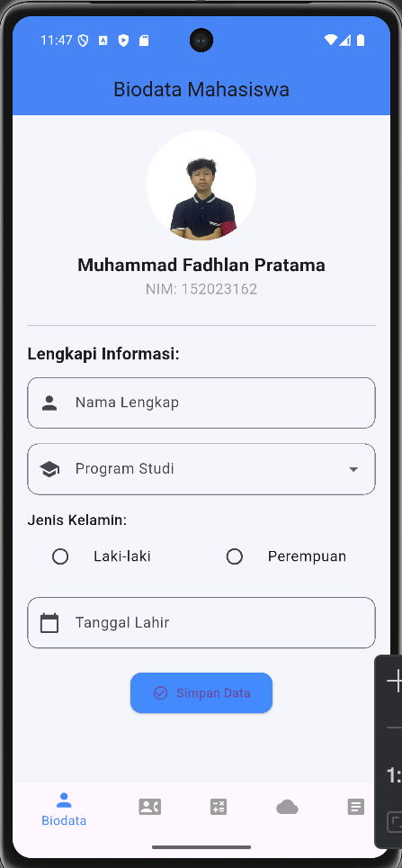
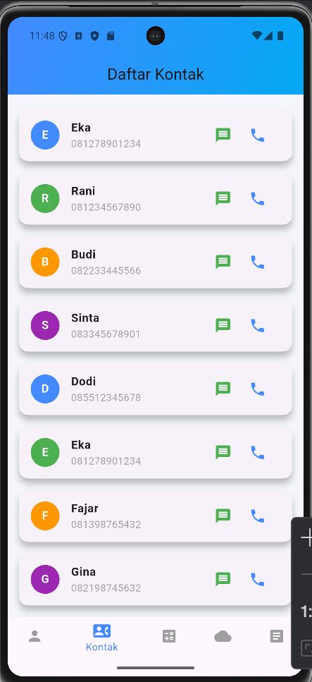
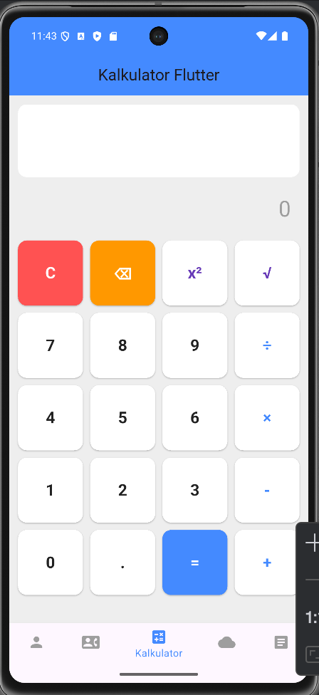
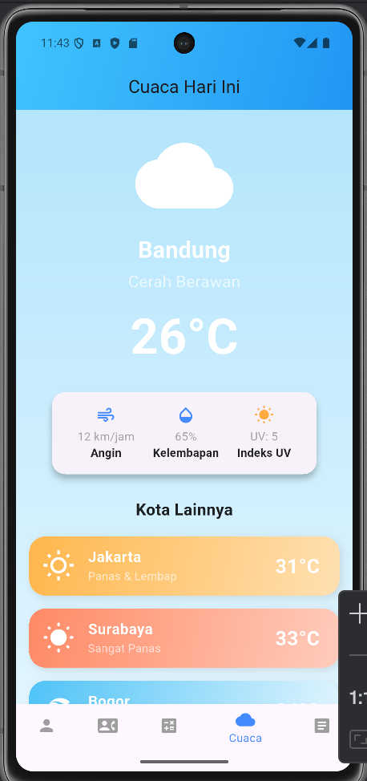
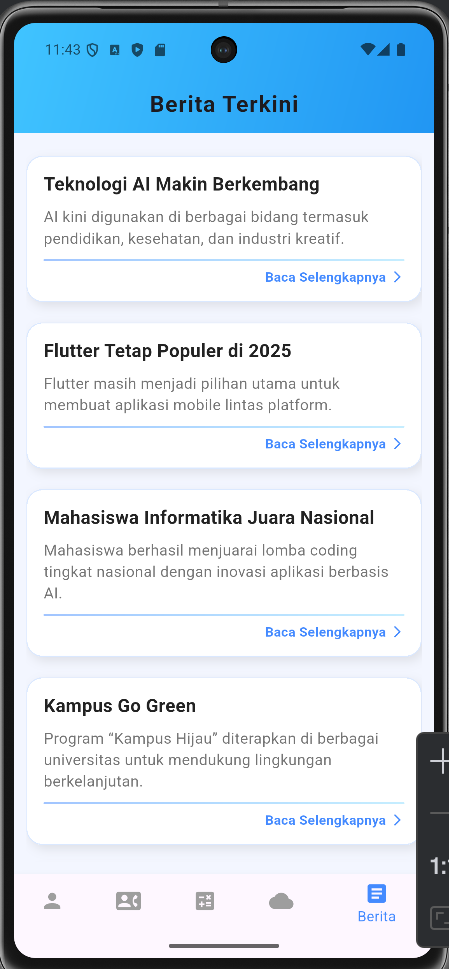

# UTS Mobile App - Pemrograman Mobile

## 📱 Informasi Mahasiswa

- *Nama*: Muhammad Fadhlan Pratama
- *NIM*: 152023162
- *Kelas*: AA
- *Dosen*: Galih Ashari R., S.Si., MT
- *Semester*: Ganjil 2024/2025

## 📋 Deskripsi Aplikasi

Aplikasi ini merupakan aplikasi mobile berbasis Flutter yang terdiri dari 5 menu utama yang dapat diakses melalui Bottom Navigation Bar. Aplikasi ini dirancang dengan UI/UX yang modern dan responsif.

## ✨ Fitur Aplikasi

### 1. Splash Screen
- Durasi tampil: 5 detik
- Menampilkan:
    - Judul aplikasi
    - Foto mahasiswa
    - NIM
    - Nama mahasiswa
- Dilengkapi dengan animasi fade-in

### 2. Dashboard dengan Bottom Navigation
Menu utama aplikasi yang terdiri dari 5 navigasi:
- Biodata
- Kontak
- Kalkulator
- Cuaca
- Berita

### 3. Halaman Biodata
Fitur:
- Menampilkan foto profil dengan desain menarik
- Form input data dengan berbagai widget:
    - TextField untuk Nama Lengkap
    - DatePicker untuk tanggal lahir (Calendar)
    - RadioButton untuk jenis kelamin
    - Dropdown untuk Program Studi
- Tombol simpan (data tidak disimpan ke database)
- UI/UX yang responsive dan modern

### 4. Halaman Kontak
Fitur:
- Daftar 20 kontak telepon statis
- Setiap kontak menampilkan:
    - Circle avatar dengan inisial
    - Nama kontak
    - Nomor telepon
    - Tombol call dan message
- Data bersifat statis dari variabel
- Tampilan card yang modern

### 5. Halaman Kalkulator
Fitur operasi matematika:
- Penjumlahan (+)
- Pengurangan (-)
- Perkalian (×)
- Pembagian (÷)
- Pangkat dua (x²)
- Akar kuadrat (√)
- Tombol Clear (C)
- Display hasil yang besar dan jelas
- UI dengan warna yang intuitif

### 6. Halaman Cuaca
Fitur:
- Informasi cuaca statis untuk kota Bandung
- Menampilkan:
    - Suhu saat ini
    - Kondisi cuaca dengan icon
    - Kelembapan
    - Angin
    - Index UV
    - Kota lainya
- Desain dengan gradient background yang menarik

### 7. Halaman Berita
Fitur:
- Daftar 5 berita statis
- Setiap berita menampilkan:
    - Judul berita
    - Ringkasan berita
- Tampilan card dengan layout yang responsive
- Baca detail

## 🛠 Teknologi yang Digunakan

- *Framework*: Flutter 3.35.1
- *Language*: Dart
- *SDK*: Dart SDK >=3.0.0 <4.0.0
- *State Management*: StatefulWidget
- *Navigation*: Bottom Navigation Bar
- *Architecture Pattern*: Fragment-based architecture

## 📂 Struktur Folder

lib/
├── Berita_page.dart
├── Biodata_page.dart
├── Cuaca_page.dart
├── dashboard_page.dart
├── Kalkulator_page.dart
├── Kontak_page.dart
├── main.dart

assets/
└── images/
└── Me.jpg

## 🚀 Cara Menjalankan Aplikasi

### Prasyarat
- Flutter SDK 3.35.1 atau lebih tinggi
- Dart SDK
- Android Studio / VS Code
- Emulator Android atau perangkat fisik

### Langkah-langkah

1. Clone repository ini
   bash
   git clone https://github.com/fadhlanpratama/UTS-Pemerograman-Mobile
   cd uts_mobile_app

2. Install dependencies
   bash
   flutter pub get

3. Jalankan aplikasi
   bash
   flutter run

## 📸 Screenshot Aplikasi

### Splash Screen

### Dashboard

### Halaman Biodata

### Halaman Kontak

### Halaman Kalkulator

### Halaman Cuaca

### Halaman Berita

## 📝 Catatan Pengembangan

### SubCPMK 2
Aplikasi ini memenuhi SubCPMK 2 dengan menerapkan berbagai jenis layout dan widget:
- *Layout*: Column, Row, ListView, Container, Card, Stack
- *Widget Input*: TextField, RadioButton, DropdownButton, DatePicker
- *Widget Display*: Text, Image, Icon, CircleAvatar
- *Navigation*: BottomNavigationBar, Fragment
- *Styling*: Gradient, BoxDecoration, Border, Shadow
- *Interaction*: Button, InkWell, GestureDetector

## 🔧 Pengembangan Selanjutnya

Fitur yang dapat dikembangkan:
- [ ] Integrasi dengan data dummy cuaca
- [ ] Integrasi dengan data dummy berita
- [ ] Import kontak yang menggunakan data dummy
- [ ] perhitungan kalkulator

## 👨‍💻 Developer

Dikembangkan oleh *Muhammad Fadhlan Pratama* untuk memenuhi tugas UTS Pemrograman Mobile.

## 📄 Lisensi

Aplikasi ini dikembangkan untuk keperluan akademik di Institut Teknologi Nasional Bandung.

---

*Institut Teknologi Nasional Bandung*  
Jl. Khp Hasan Mustopa No.23, Bandung - 40124  
© 2024